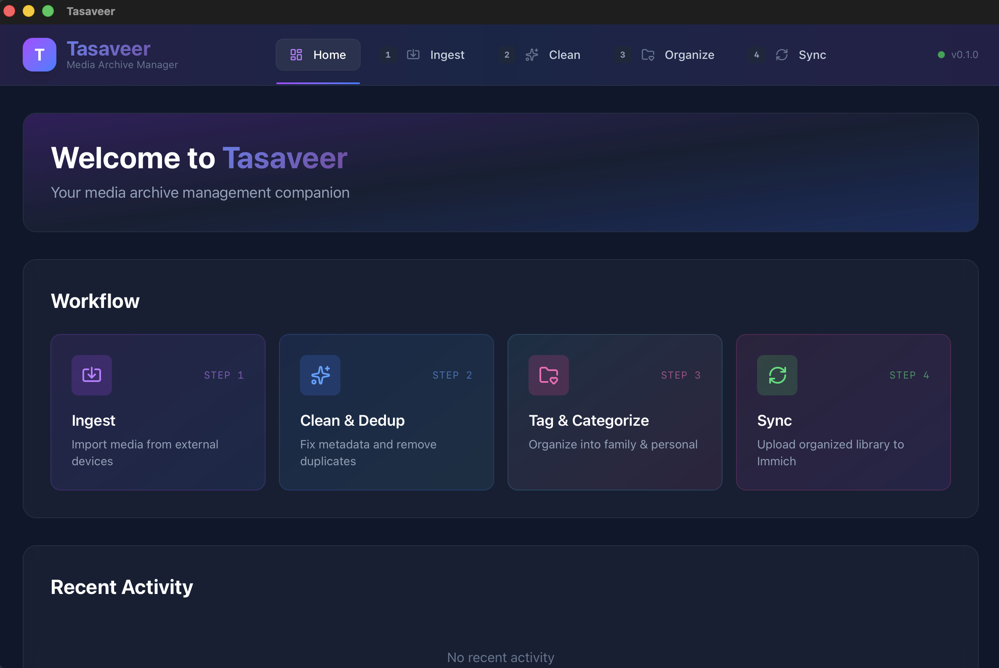
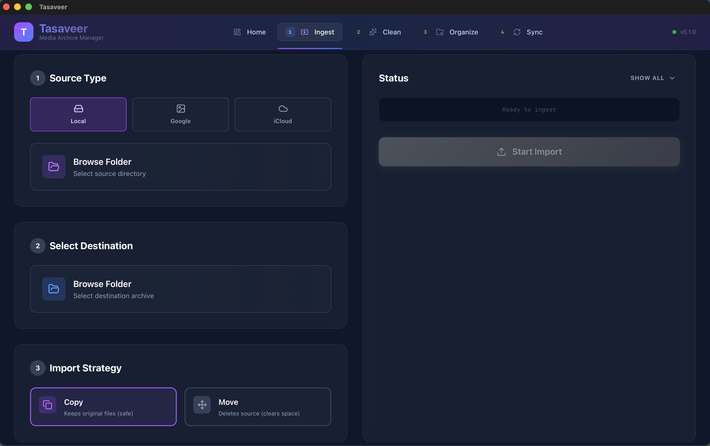
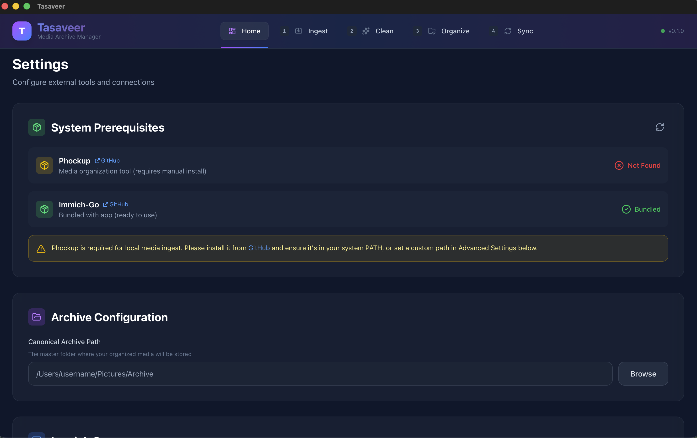

# Tasaveer


Tasaveer is a media ingestion tool for photographers and videographers. It simplifies the process of importing media from various sources (like SD cards) into an organized archive on your local machine.



## Features

- **Ingest Workflow**: Streamlined process to select source and destination paths.
- **Import Strategies**:
  - **Copy**: Safely duplicates files (keeps originals).
  - **Move**: Transfers files and clears source (saves space).
- **Control**: Start and cancel operations safely at any time.
- **Monitoring**: Real-time progress logs.


## Workflow

Tasaveer is designed around a 3-step workflow to ensure your media library is pristine before it reaches your permanent storage or Immich server.

1.  **Ingest**
    Copy over and extract images and videos from various sources like HDD backups, Google Photos Takeout, and SD cards. This step performs basic hash-based deduplication using tools like `phockup`.

    

2.  **Clean and Dedup**
    Extract missing metadata (e.g., dates from WhatsApp images) and perform advanced similarity-based deduplication using **Czkawka**. This step allows for stacking similar pictures and deduplicating lower-resolution copies.

3.  **Tag and Categorize**
    Separate and organize media into logical groups (e.g., Family Shared vs. Personal Phone). The end result is a structured set of folders ready to be added as External Libraries in Immich.

4.  **Sync to Immich**
    Link the organized folders as External Libraries in Immich and trigger a library scan to update your cloud archive.

## Installation and Prerequisites

### Bundled Dependencies

Tasaveer comes with **immich-go bundled** for Google Photos and iCloud imports. No additional installation is required for these features.

### Phockup (Required for Local Ingest)

For local media ingestion (from SD cards, folders, etc.), you need to install `phockup`. This cannot be bundled due to its Python + ExifTool dependencies.

> **Upstream Repository**: [ivandokov/phockup](https://github.com/ivandokov/phockup)

#### MacOS

The Homebrew formula for phockup is currently broken. Please use `pipx` to install it reliably:

```bash
# 1. Install pipx (if not already installed)
brew install pipx
pipx ensurepath

# 2. Install phockup from source
pipx install git+https://github.com/ivandokov/phockup.git
```

#### Windows

1. **Install Python 3** (if not already installed):
   - Download from [python.org](https://www.python.org/downloads/windows/) or use Winget:
   ```powershell
   winget install Python.Python.3.13
   ```

2. **Install ExifTool** (required by phockup):
   ```powershell
   winget install OliverBetz.ExifTool --accept-package-agreements --accept-source-agreements
   ```

3. **Install phockup**:
   ```powershell
   # Clone phockup to your local Programs folder
   git clone --depth 1 https://github.com/ivandokov/phockup.git "$env:LOCALAPPDATA\Programs\phockup"

   # Install Python dependencies
   pip install -r "$env:LOCALAPPDATA\Programs\phockup\requirements.txt"

   # Add phockup to your PATH
   [Environment]::SetEnvironmentVariable("Path", $env:Path + ";$env:LOCALAPPDATA\Programs\phockup", [EnvironmentVariableTarget]::User)

   # Create a batch wrapper for easy execution
   Set-Content -Path "$env:LOCALAPPDATA\Programs\phockup\phockup.bat" -Value '@echo off','python "%~dp0phockup.py" %*'
   ```

4. **Restart your terminal** to pick up the new PATH, then verify:
   ```powershell
   phockup --version
   ```

### Custom Binary Paths

You can override the bundled or PATH binaries with your own custom installations in **Settings → Advanced: Custom Binary Paths**. This is useful if you want to:
- Use a specific version of immich-go
- Point to phockup installed in a non-standard location



### External Dependencies Reference

| Tool | Bundled | Repository |
|------|---------|------------|
| **immich-go** | ✅ Yes | [simulot/immich-go](https://github.com/simulot/immich-go) |
| **phockup** | ❌ No (requires Python) | [ivandokov/phockup](https://github.com/ivandokov/phockup) |
| **ExifTool** | ❌ No (required by phockup) | [exiftool.org](https://exiftool.org/) |

## Developing Guide

This template should help get you started developing with Tauri, React and Typescript in Vite.

### Recommended IDE Setup

- [VS Code](https://code.visualstudio.com/) + [Tauri](https://marketplace.visualstudio.com/items?itemName=tauri-apps.tauri-vscode) + [rust-analyzer](https://marketplace.visualstudio.com/items?itemName=rust-lang.rust-analyzer)

### Windows Development Setup

1.  **Install Rust**:
    *   Download and run `rustup-init.exe` from [rust-lang.org](https://www.rust-lang.org/tools/install).
    *   Or use Winget: `winget install Rustlang.Rustup`.
2.  **C++ Build Tools**:
    *   Ensure "Desktop development with C++" is installed via Visual Studio Build Tools.
