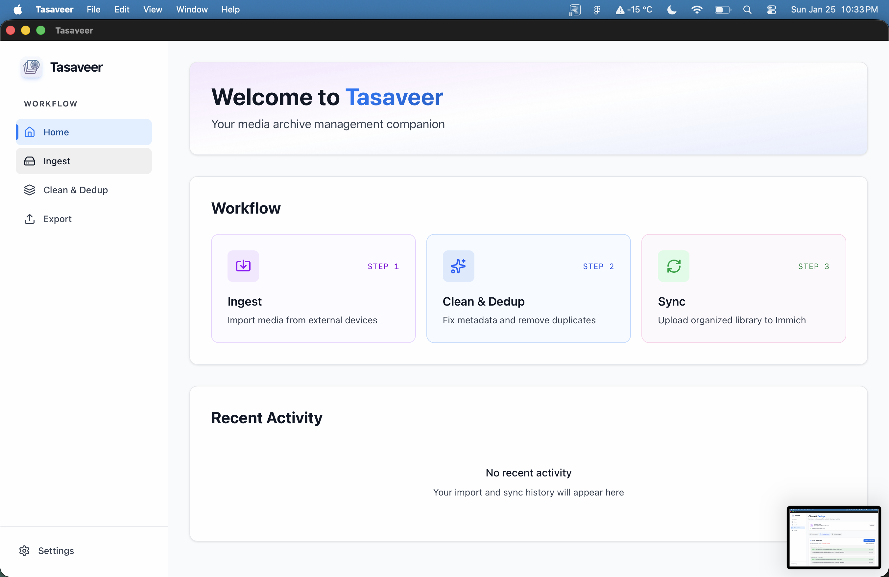
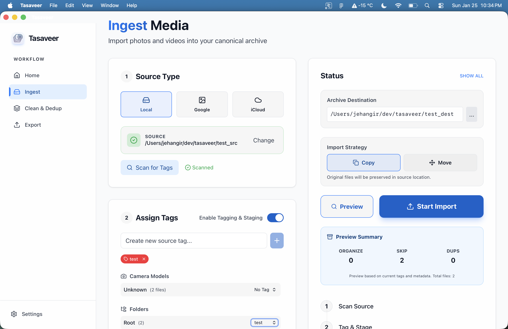
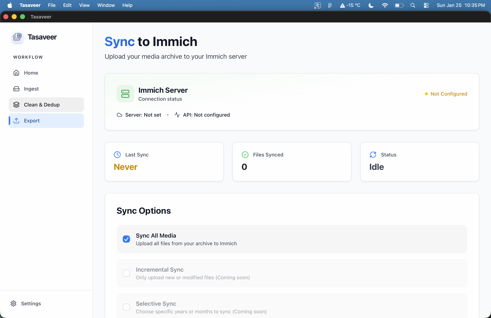
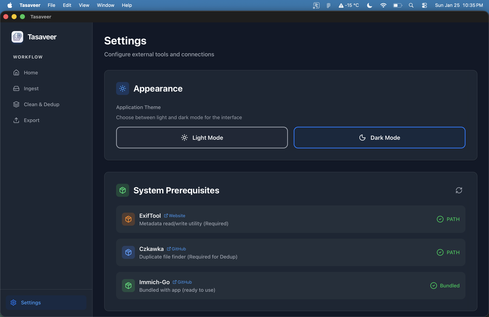

# Tasaveer

<!-- markdownlint-disable -->


Tasaveer (/t̪ə.sɑː.ˈʋiːɾ/, Urdu: تصاویر, lit. 'photographs') is a media management tool which simplifies the process of importing media from various sources (like SD cards, Google Photos Takeout, and iCloud Takeout) into an organized local archive.

[](https://github.com/kazijehangir/tasaveer/actions/workflows/test.yml)
[](https://codecov.io/gh/kazijehangir/tasaveer)

## Features

- **Ingest Workflow**: Import media from various sources (local drive, Google Photos, iCloud).
- **Smart Tagging**: Automatically file media by camera model or directory patterns during ingest.
- **Import Strategies**:
  - **Copy**: Safely duplicates files (keeps originals).
  - **Move**: Transfers files and clears source (saves space).
- **Deduplication**: Visual interface for `czkawka` to find and remove duplicates.
- **Control**: Start and cancel operations safely at any time.

## Workflow

Tasaveer is designed around a 3-step workflow to ensure your media library is pristine before it reaches your permanent storage or Immich server.



1. **Ingest & Tag**
    Copy or move images and videos from sources like SD cards, Google Photos Takeout, or local folders. During this step, you can assign tags based on camera models or source directories to organize files automatically.

    

2. **Clean and Dedup**
    find duplicate files and similar images using **Czkawka**. This step allows for stacking similar pictures and deduplicating lower-resolution copies.

3. **Sync to Immich**
    Link the organized folders as External Libraries in Immich and trigger a library scan to update your cloud archive.

    

## Installation and Prerequisites

### Bundled Dependencies

Tasaveer comes with **immich-go** and **ExifTool** bundled for core operations. No additional installation is typically required for these.

### Czkawka (Required for Deduplication)

For finding duplicate files and similar images, you need to install `czkawka_cli`.

#### MacOS

```bash
# Install via Homebrew
brew install czkawka
```

#### Windows

Download the `czkawka_cli` executable from [qarmin/czkawka](https://github.com/qarmin/czkawka/releases) and add it to your PATH, or specify its location in Settings.

### Custom Binary Paths

You can override the bundled or PATH binaries with your own custom installations in **Settings → Advanced: Custom Binary Paths**.



### External Dependencies Reference

| Tool | Bundled | Repository |
| --- | --- | --- |
| **immich-go** | ✅ Yes | [simulot/immich-go](https://github.com/simulot/immich-go) |
| **ExifTool** | ✅ Yes | [exiftool.org](https://exiftool.org/) |
| **czkawka** | ❌ No | [qarmin/czkawka](https://github.com/qarmin/czkawka) |

## Developing Guide

This template should help get you started developing with Tauri, React and Typescript in Vite.

### Recommended IDE Setup

- [VS Code](https://code.visualstudio.com/) + [Tauri](https://marketplace.visualstudio.com/items?itemName=tauri-apps.tauri-vscode) + [rust-analyzer](https://marketplace.visualstudio.com/items?itemName=rust-lang.rust-analyzer)

### Windows Development Setup

1. **Install Rust**:
    - Download and run `rustup-init.exe` from [rust-lang.org](https://www.rust-lang.org/tools/install).
    - Or use Winget: `winget install Rustlang.Rustup`.
2. **C++ Build Tools**:
    - Ensure "Desktop development with C++" is installed via Visual Studio Build Tools.

### Running Tests

Run all frontend tests:

```bash
npm test              # Watch mode
npm run test:coverage # With coverage report
```

Run Rust backend tests:

```bash
cargo test --manifest-path src-tauri/Cargo.toml --lib
```
